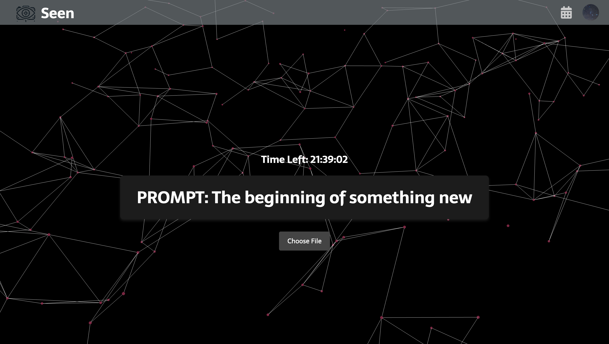

# Seen

Made by Abhay Bestrapalli, Mason Fang, Orion Foo, and Nathan Xiong.

## How it works

Each day, a prompt is generated, and each user uploads a photo that they think fits the prompt. All users can then vote on what they think is the best/funniest/etc. photo of the day.

## What we used

We used the following technologies:
* [Vanta.js](https://www.vantajs.com/) for providing smooth and clean animated website backgrounds. 
* [Node.js](https://nodejs.org/en) 
* [MongoDB](https://www.mongodb.com/)
* [React](https://react.dev/)
* [Google OAuth](https://developers.google.com/identity/protocols/oauth2)
